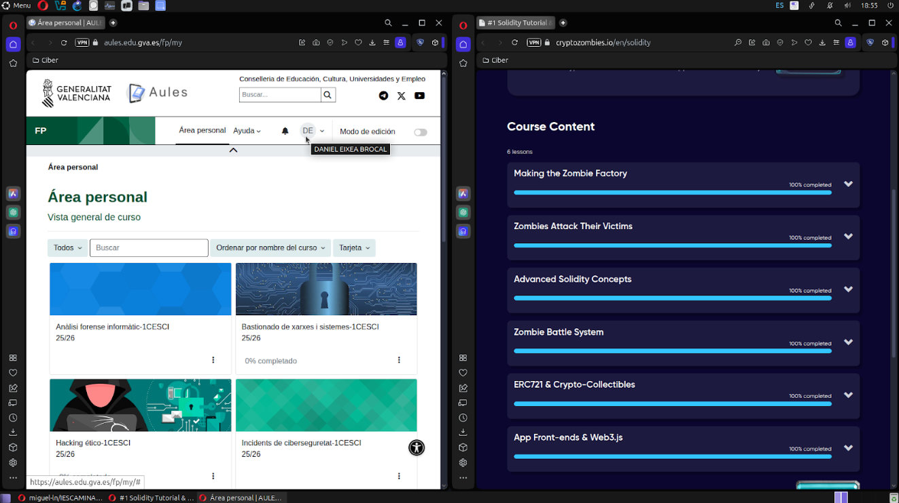

# Capturas
Capturas del progreso del [tutorial de Solidity](https://cryptozombies.io/en/solidity):

# Smart Contract
Para ejecutar el Smart Contract se ha utilizado [Remix IDE](https://remix.ethereum.org/#lang=en&optimize&runs=200&evmVersion&version=soljson-v0.8.30+commit.73712a01.js):
- Creamos un archivo nuevo archivo.sol
- Copiamos y pegamos el código que se quiere probar
- Luego en la pestana **Solidity Compiler** elegimos la version 0.8.0 (o superior) y lo compilamos
- Una vez compilado en la pestaña **Deploy & Run Transactions** desplegamos el contrato
- Una vez ejecutado veremos que un poco mas abajo del boton **Deploy** en **Deploy Contracts** aparecerá nuestro contrato, el cual si desplegamos dandole a la **``>``** nos dejará interactuar con las opciones que le hemos definido en el código